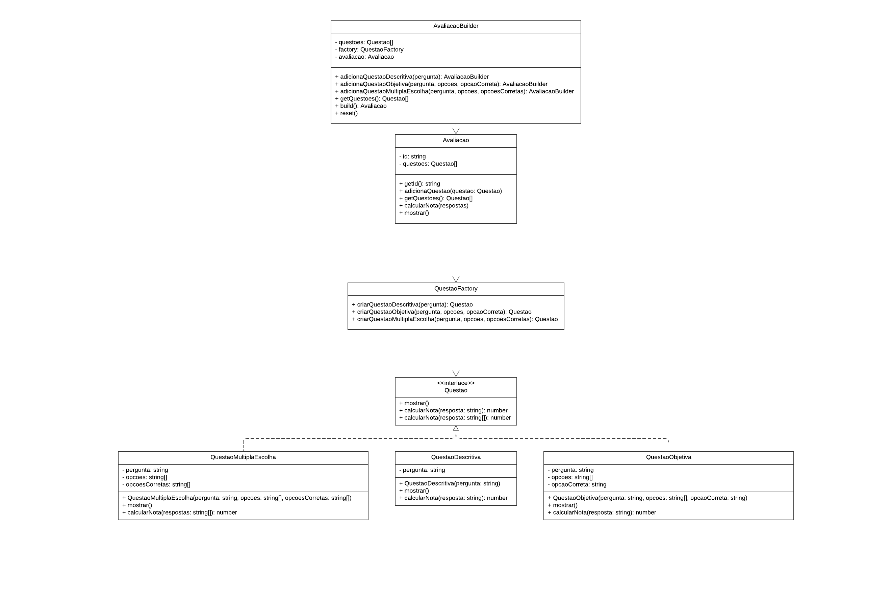

# ABP Design Patterns

## 📊 Diagrama

<a href="https://lucid.app/lucidchart/0b0a8b61-0d74-48c2-bdfb-b6689f98723e/edit?invitationId=inv_0dc0b84c-7c7a-4f48-af11-15a68e36b4ab&page=HWEp-vi-RSFO#">

</a>

## 📓 Pré-Requisitos

1. **Instalar o Node.js**: A primeira coisa a fazer é instalar o [Node.js](https://nodejs.org/), que inclui o npm (gerenciador de pacotes do Node.js).
2. **Instalar o TypeScript globalmente**: Instale o TypeScript globalmente para poder compilar o código TypeScript.
   ```bash
   npm install -g typescript
   ```

## 👣 Passos

#### Instalar as dependências do projeto com npm

```bash
npm install
```

#### Compilar o código TypeScript

Para compilar o código TypeScript antes de executá-lo, execute o seguinte comando:

```bash
npm run build
```

#### Executar os scripts

Após compilar o código, execute o seguinte comando:

```bash
npm start
```
